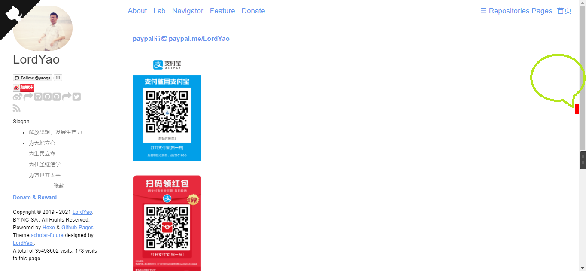
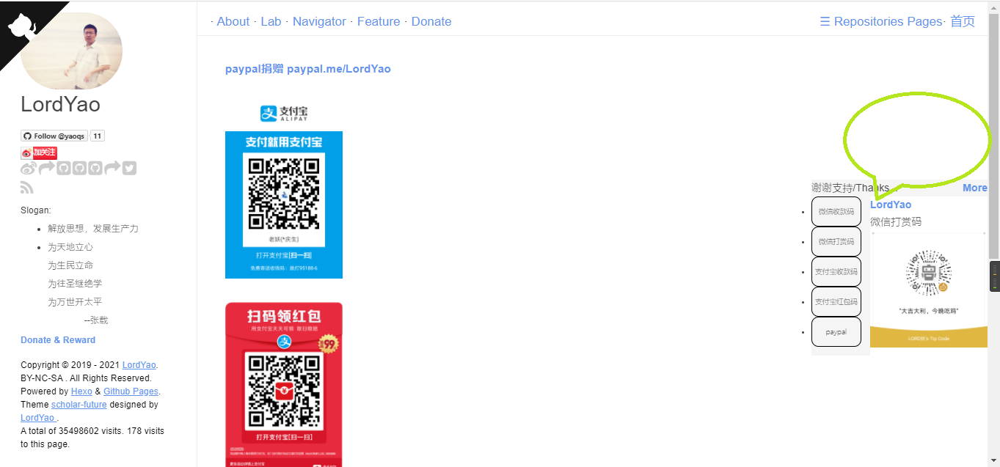

# donate-plugin
Donate &amp; Reward 大吉大利，今晚吃鸡
## code
在html中插入以下代码，并将js文件引入html的head标签中即可
```js
<script type="text/javascript" src="js/zanzhu_yaoqs.js"></script>
/*!
* zanzhu_yaoqs JavaScript Library v1.0.0
* http://github.com/yaoqs
*
* Copyright 2021-, yaoqs[LordYao]
* Released under the MIT license
*
* 3rd Party Library:
* 1.Jquery
* 2.Jquery.qrcode
*
* Date: 2021-10-01
*/
<script>
 
      $(function(){
          new Rewardtip(
              {
                  "tiptext":"谢谢支持/Thanks...",
                  "more":"./donate.html",
                  "list":[
                      {name:"微信收款码",qrimg:"./images/微信收款码.png"},
                      {name:"微信打赏码",qrimg:"./images/微信打赏码.png"},
                      {name:"支付宝收款码",qrimg:"./images/支付宝收款码.jpg"},
                      {name:"支付宝红包码",qrimg:"./images/支付宝红包码.jpg"}
                  ],
                  "link":[
                      {name:"paypal",desc:"paypal.me/LordYao",link:"https://www.paypal.com/cgi-bin/webscr?cmd=_xclick&business=243292490@qq.com&currency_code=USD&amount=1&return=http://yaoqs.github.com/about&item_name=LordYao%27s%20Blog&undefined_quantity=1"}
                  ]/*,
                  fn:(function(){
                      return alert("解放思想，发展生产力");
                  })()*/
              });
      })
  
  </script>
  ```
## demo


## project
- [ ] 扩展sider主题、样式
- [ ] 打包封装
